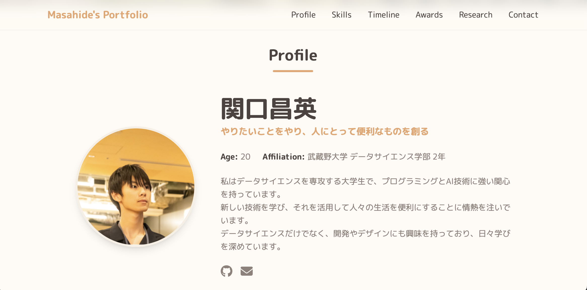

# Next.js & AWS Portfolio (CMS機能付き)

これは、Next.js (App Router) と Tailwind CSS で構築された、モダンで高速なポートフォリオサイトです。コンテンツ管理に**AWS DynamoDB**を使用し、サイトの情報をデプロイ後に**管理者画面から直接編集できる**CMS（コンテンツ管理システム）機能を搭載しています。



## ✨ 特徴

-   **動的なコンテンツ管理**: AWS DynamoDBに保存された情報を元にサイトが生成されます。
-   **管理者機能**: 秘密の管理者ページ (`/admin`) からログインし、サイトに表示されるほぼ全てのテキスト情報（プロフィール、スキル、経歴など）を**デプロイし直すことなく**リアルタイムで更新できます。
-   **モダンな技術スタック**: Next.js (App Router) を採用し、サーバーコンポーネントによる高速な表示と優れた開発体験を実現します。
-   **インタラクティブなUI**: プロダクト紹介はスワイプ可能なカルーセル形式で表示されます。
-   **高い拡張性**: AWSのサービス（Amplify, DynamoDB）をベースに構築されており、今後の機能追加にも柔軟に対応できます。
-   **デザインのカスタマイズ性**: Tailwind CSS を使用しており、カラーテーマやフォントの変更が容易です。

---

## 📂 ファイル構成と役割

このプロジェクトの主要なファイルとフォルダの役割は以下の通りです。

```

.
├── public/                 # 画像などの静的ファイル置き場
├── scripts/
│   └── migrate.ts          # ★初期データをDBに移行するスクリプト
├── src/
│   ├── app/
│   │   ├── admin/          # ★管理者画面用のページ
│   │   ├── api/            # ★ログインやDB連携用のAPI
│   │   ├── globals.css     # サイト全体のグローバルCSS
│   │   ├── layout.tsx      # 全ページ共通のレイアウト
│   │   └── page.tsx        # ★メインページの司令塔
│   ├── components/         # 各セクションのReactコンポーネント
│   ├── data/
│   │   ├── config.ts       # 初期データとタグスタイルを管理
│   │   └── tagStyles.ts    # （分離した場合）タグスタイルを管理
│   └── lib/
│       └── dynamodb.ts     # ★AWS DynamoDBとの通信ロジック
├── .env.local              # ★AWS情報やパスワードなどの秘密鍵
├── middleware.ts           # ★管理者ページへのアクセス制御
├── next.config.js          # Next.jsの動作設定ファイル
├── package.json            # プロジェクト情報と依存パッケージ
└── tailwind.config.ts      # Tailwind CSSのデザイン設定

```

-   **`src/app/page.tsx`**: サイトのメインページ。サーバーコンポーネントとして動作し、表示に必要なデータをAWS DynamoDBから取得して、各部品コンポーネントに渡す「司令塔」の役割を担います。
-   **`src/components/`**: サイトを構成する部品（ヘッダー、各セクション）が入っています。`page.tsx`から渡されたデータを元に表示を行います。
-   **`src/lib/dynamodb.ts`**: AWS DynamoDBと通信し、サイトのコンテンツを取得するための関数が定義されています。
-   **`src/app/admin/`**: 管理者機能に関連するページ（ログイン画面、ダッシュボード）が格納されています。
-   **`src/app/api/`**: 認証（ログイン・ログアウト）やコンテンツの更新処理を行う、サーバーサイドのAPIが格納されています。
-   **`middleware.ts`**: 管理者ページへのアクセスを制御し、未ログインのユーザーをログインページにリダイレクトさせる「門番」の役割を果たします。
-   **`scripts/migrate.ts`**: 開発の初期段階で、`src/data/config.ts`に記述した内容をDynamoDBに一括で登録するための移行用スクリプトです。
-   **`tailwind.config.ts`**: サイトの**見た目（色、フォントなど）**を根本的に変更したい場合に編集します。
-   **`.env.local`**: AWSの認証情報や、管理者画面のパスワードなど、外部に公開してはいけない秘密の情報を管理します。

---
## 🚀 セットアップ方法

1.  **AWSの準備**:
    * AWSアカウントを作成し、IAMユーザーを発行してアクセスキーを取得します。
    * Amazon DynamoDBで、サイトのコンテンツを保存するためのテーブルを1つ作成します。

2.  **プロジェクトのセットアップ**:
    * リポジトリをクローンし、`pnpm install`で依存パッケージをインストールします。

3.  **環境変数の設定**:
    * `.env.local.example`をコピーして`.env.local`というファイルを作成します。
    * 取得したAWSのアクセスキー、DynamoDBのテーブル名、リージョンなどを設定します。
    * 管理者画面のログインパスワードや、セッションを暗号化するための秘密鍵も設定します。

4.  **初期データの移行**:
    * `src/data/config.ts`に必要な情報を記述します。
    * `pnpm run migrate`コマンドを実行し、`config.ts`の内容をAWS DynamoDBに登録します。

5.  **開発サーバーを起動**:
    * `pnpm dev`を実行し、`http://localhost:3000`でサイトが表示されることを確認します。
    * `http://localhost:3000/admin`にアクセスし、管理者画面にログインできることを確認します。

6.  **デプロイ**:
    * **AWS Amplify**へのデプロイが推奨されます。
    * GitHubリポジトリと連携すれば、サーバー機能（APIルートなど）を含むNext.jsアプリケーションを簡単に公開できます。
    * デプロイ時には、Amplifyの環境変数設定画面で`.env.local`の内容を正しく設定する必要があります。

---
## 🔧 サイトの更新方法

サイトの公開後、内容を更新する方法は2つあります。

### 1. 管理者画面から更新する (推奨)
1.  サイトの`/admin`にアクセスし、設定したパスワードでログインします。
2.  右側のJSONエディタで、プロフィールや経歴などのテキスト情報を直接編集します。
3.  左側のプレビュー画面で変更がリアルタイムに反映されるのを確認します。
4.  「保存」ボタンを押すと、変更がAWS DynamoDBに保存され、**即座に公開サイトに反映されます**。

### 2. `config.ts`を編集して再移行する
新しいセクション（例: プロダクト）を追加する場合など、データ構造自体を変更したい場合は、以下の手順を踏みます。

1.  `config.ts`に新しいデータを追加・編集します。
2.  `pnpm run migrate`を実行して、データベースの内容を更新します。
3.  変更をGitにプッシュし、AWS Amplify経由で再デプロイします。

---
## 🛠️ 使用技術

-   **Frontend**: Next.js (App Router), React, TypeScript, Tailwind CSS
-   **Backend**: Next.js (API Routes), AWS DynamoDB
-   **Authentication**: JWT (jose)
-   **Deployment**: AWS Amplify
-   **UI/Libraries**: Swiper.js, React Icons, Monaco Editor