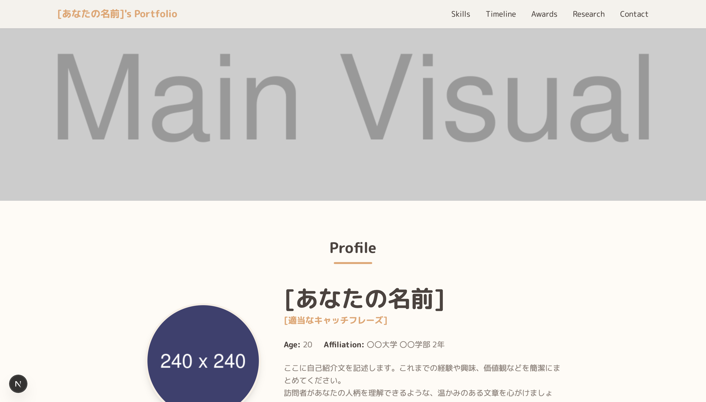

# Next.js & Tailwind CSS Portfolio Template (大学生用)

これは、Next.js (App Router) と Tailwind CSS を使用して構築された、モダンでカスタマイズ性の高い大学生のポートフォリオサイトのテンプレートです。パッケージマネージャーとして`pnpm`の使用を推奨しています。



## ✨ 特徴

- **データの一元管理**: `src/data/config.ts` ファイルを編集するだけで、プロフィール、スキル、経歴などの全情報を簡単に更新できます。
- **動的な情報表示**: 年齢や学年が自動で計算・更新されます。
- **インタラクティブなUI**: タイムラインセクションでは、タグによる絞り込みと、日付による並び替えが可能です。
- **モダンな技術スタック**: Next.js (App Router) を採用し、高速な表示と優れた開発体験を実現します。
- **デザインのカスタマイズ性**: Tailwind CSS を使用しており、カラーテーマやフォントの変更が容易です。
- **レスポンシブ対応**: PCからスマートフォンまで、様々なデバイスで美しく表示されます。

---

## 📂 ファイル構成と役割

このプロジェクトの主要なファイルとフォルダの役割は以下の通りです。

```
.
├── public/              # 画像などの静的ファイル置き場
├── src/
│   ├── app/
│   │   ├── globals.css  # サイト全体のグローバルCSS
│   │   ├── layout.tsx   # 全ページ共通のレイアウト（骨格）
│   │   └── page.tsx     # メインページの本体
│   ├── components/      # 各セクションのReactコンポーネント
│   └── data/
│       └── config.ts    # ★サイトの全データを管理する設定ファイル
├── .gitignore           # Gitの追跡から除外するファイルを設定
├── next.config.mjs      # Next.jsの動作設定ファイル
├── package.json         # プロジェクト情報と依存パッケージのリスト
├── pnpm-lock.yaml       # 依存パッケージのバージョンを固定するファイル
├── postcss.config.js    # PostCSS（Tailwind CSSの動作に必要）の設定
├── README.md            # このファイル
└── tailwind.config.ts   # Tailwind CSSのデザイン設定（色、フォントなど）
```

-   **`src/data/config.ts`**: ★最重要ファイル。あなたのプロフィール、スキル、経歴など、サイトに表示する**テキストやデータはすべてここで編集します**。
-   **`src/app/page.tsx`**: 各セクションのコンポーネントを組み合わせて、ページのレイアウトを決定します。セクションを非表示にしたい場合はこのファイルを編集します。
-   **`src/components/`**: サイトを構成する部品（ヘッダー、フッター、各セクション）が入っています。デザインやレイアウトを大きく変更したい場合に編集します。
-   **`public/`**: プロフィール画像やメインビジュアルなどの画像ファイルは、このフォルダに置いて使うのが一般的です。
-   **`tailwind.config.ts`**: サイトの**見た目（色、フォントなど）**を根本的に変更したい場合に編集します。

### ### Components フォルダの中身

`src/components/` フォルダ内の各コンポーネントは、サイトの各セクションに対応しています。

-   `Header.tsx`: サイト上部に固定表示されるヘッダー。ナビゲーションリンクが含まれます。
-   `Footer.tsx`: サイト下部に表示されるフッター。コピーライト表記とナビゲーションリンクが含まれます。
-   `Hero.tsx`: ページのトップに表示されるメインビジュアルとプロフィール紹介エリアです。年齢や学年の自動計算もここで行われます。
-   `Skills.tsx`: あなたの技術スタックをカテゴリ別に表示するセクションです。
-   `Certifications.tsx`: 取得した資格を一覧表示するセクションです。
-   `Timeline.tsx`: 学歴や職歴、イベント参加歴などを時系列で表示するセクションです。タグでの絞り込みや並び替え機能があります。
-   `Awards.tsx`: 受賞歴をカード形式で表示するセクションです。
-   `Research.tsx`: 研究内容をカード形式で表示するセクションです。
-   `Contact.tsx`: SNSやメールへのリンクをまとめた連絡先セクションです。

---

## 🚀 セットアップ方法

1.  **pnpmをインストール:**
    もし`pnpm`をインストールしていない場合は、以下のコマンドでインストールします。
    ```bash
    npm install -g pnpm
    ```

2.  **リポジトリをクローンまたはダウンロード:**
    ```bash
    git clone https://github.com/Masahide-S/portfolio-template-for-students
    cd portfolio-template-for-students
    ```

3.  **必要なパッケージをインストール:**
    Node.jsがインストールされていることを確認してから、以下のコマンドを実行します。
    ```bash
    pnpm install
    ```

4.  **設定ファイルを編集:**
    `src/data/config.ts` を開き、あなたの情報（プロフィール、SNSリンク、スキル、経歴など）に書き換えてください。

5.  **開発サーバーを起動:**
    ```bash
    pnpm dev
    ```
    ブラウザで `http://localhost:3000` を開き、サイトが表示されることを確認します。

6.  **デプロイ:**
    Vercelへのデプロイが推奨されています。GitHubリポジトリと連携すれば、数クリックで簡単に公開できます。Vercelは自動で`pnpm`を認識してくれます。

---

## 🔧 カスタマイズガイド

### データの更新

このテンプレートでは、サイトに表示されるほぼ全てのデータが **`src/data/config.ts`** ファイルで管理されています。内容を変更したい場合は、このファイルを編集してください。

- **プロフィール**: 名前、キャッチコピー、自己紹介文など
- **スキル**: 表示する技術スタックとアイコン
- **経歴・受賞歴など**: 各セクションの項目

### セクションの表示・非表示

特定のセクション（例: 「資格 (Certifications)」）が不要な場合は、以下の2ステップで簡単に非表示にできます。

1.  **メインページからコンポーネントを削除:**
    `src/app/page.tsx` を開き、不要なセクションのコンポーネントの行を削除（またはコメントアウト）します。
    ```tsx:src/app/page.tsx
    // import Certifications from "@/components/Certifications"; // ← インポートを削除

    export default function Home() {
      return (
        <main>
          {/* ... */}
          <Skills />
          {/* <Certifications /> */} {/* ← 表示部分を削除 */}
          <Timeline />
          {/* ... */}
        </main>
      );
    }
    ```

2.  **ヘッダーとフッターからリンクを削除:**
    `src/data/config.ts` を開き、`header.navItems` の配列から、不要なセクションへのリンクを削除します。
    ```ts:src/data/config.ts
    header: {
      navItems: [
        { name: 'Skills', href: '#skills' },
        // { name: 'Certifications', href: '#certifications' }, // ← この行を削除
        { name: 'Timeline', href: '#timeline' },
        // ...
      ],
    },
    ```

### デザイン（色合い）の変更

サイト全体のカラーテーマは **`tailwind.config.ts`** ファイルで定義されています。

```ts:tailwind.config.ts
// ...
    extend: {
      colors: {
        'base': '#FFFBF5',      // 基本背景色
        'surface': '#F7EFE5',   // 第二背景色
        'primary': '#E7A46E',   // メインのアクセントカラー
        'text-main': '#4C433E',  // メインテキスト色
        'text-sub': '#8E827A',   // サブテキスト色
      },
      // ...
    },
// ...
```
これらのカラーコード（例: `#FFFBF5`）を好きな色に変更するだけで、サイト全体の雰囲気を簡単に変えることができます。変更後は、開発サーバーの再起動を忘れないでください。

---

## 🛠️ 使用技術

-   [Next.js](https://nextjs.org/) - Reactフレームワーク
-   [React](https://reactjs.org/) - UIライブラリ
-   [TypeScript](https://www.typescriptlang.org/) - JavaScriptへの型付け
-   [Tailwind CSS](https://tailwindcss.com/) - CSSフレームワーク
-   [React Icons](https://react-icons.github.io/react-icons/) - アイコンライブラリ
-   [Tailwind Scrollbar](https://github.com/adoxography/tailwind-scrollbar) - スクロールバーのデザイン

---